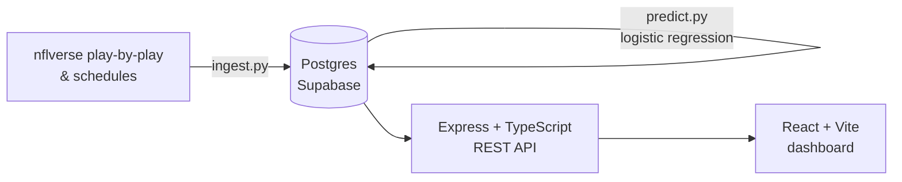

# NFL Team Efficiency Dashboard


A data pipeline, REST API, and win-probability model built on top of
[nflverse](https://github.com/nflverse/nflverse-data) play-by-play data —
surfacing team efficiency (EPA/play, success rate, points/drive) beyond raw
box scores, and predicting game outcomes from that efficiency data.

**Status:** data pipeline, API, prediction model, and the React dashboard are
all built and working end-to-end against a real season of data. Not yet
deployed — see [Roadmap](#roadmap).

## Why EPA and success rate instead of raw yards/points

Raw yardage and point totals are noisy: a team can rack up yards against a
prevent defense in a blowout, or lose a close game on one fluky turnover.
**EPA (Expected Points Added)** measures how much a play actually moved a
team's expected scoring outcome given down, distance, and field position —
so a 4-yard gain on 3rd-and-3 (a successful, drive-extending play) scores
very differently than a 4-yard gain on 3rd-and-15. **Success rate** (percent
of plays with positive EPA) captures consistency independent of occasional
explosive plays. Together they're a much better proxy for "is this team
actually good on offense/defense" than yards or points alone — which is why
they're the foundation of every metric this project computes, rather than
just mirroring a standard box score.

## Architecture



- **Ingestion** (`ingest.py`): pulls a season's schedules, play-by-play, and
  player-week stats from nflverse, computes offense/defense/special-teams
  efficiency per team per week, and upserts everything into Postgres.
  Idempotent — safe to re-run every week as new games are played.
- **Prediction** (`predict.py`): builds each team's season-to-date efficiency
  "form" entering every game (falling back to the prior season's numbers for
  week 1), trains a logistic regression on home-vs-away efficiency
  differentials, and stores a win probability for every game that hasn't
  been played yet.
- **API** (`api/`): Express + TypeScript REST API serving teams, weekly
  trend data, head-to-head comparisons, leaderboards, and win-probability
  predictions.
- **Frontend** (`frontend/`): React + Vite dashboard — leaderboard, a
  per-team trend page, a head-to-head comparison page, and an upcoming-games
  predictions page. See [Frontend](#frontend) below.

## Tech stack

| Layer | Choice |
|---|---|
| Data source | [nflverse-data](https://github.com/nflverse/nflverse-data) (play-by-play, schedules, player stats) |
| Ingestion / ML | Python, pandas, scikit-learn |
| Database | PostgreSQL (Supabase) |
| API | Node.js, Express, TypeScript |
| Frontend | React (Vite), TypeScript, Tailwind CSS, TanStack Query, Recharts |

## Reasoning for tech stack

**Data Source**: nflverse is a very detailed library of data, with new data coming in every week during the season. Nflverse provides more advanced metrics that can more accurately determine a team or a player's success.
**Ingestion / ML**: Python, pandas, scikit-learn are all very common for data ingestion and machine learning with thorough documentation.
**Database**: Familiar with PostgreSQL and Supabase was free.
**API**: I have 3 years of experience working with Node.js, Express, and TypeScript, so this felt the most comfortable for me.
**Frontend**: I have 3 years of experience working with React components, and around 1 year of experience with Recharts. TanStack Query replaces hand-rolled `useEffect` data fetching with caching and loading/error states out of the box; the API's OpenAPI spec is used to generate the frontend's TypeScript types (`npm run generate-types` in `frontend/`) instead of hand-copying them, so the two apps can't drift out of sync silently.

## Project structure

```
nfl-metrics/
  schema.sql          # Postgres schema: teams, games, player_stats, team_week_stats, game_predictions
  ingest.py            # nflverse -> Postgres, run per season/week
  predict.py           # trains model, backtests, writes win probabilities
  requirements.txt
  api/
    openapi.yaml         # API contract - source of truth for Swagger UI and frontend codegen
    src/
      index.ts          # Express app entrypoint
      app.ts             # Express app construction (importable by tests)
      db.ts              # Postgres connection pool
      routes/            # teams, compare, leaderboard, predictions
      lib/                # shared metric whitelist, query helpers
      __tests__/           # Vitest + supertest integration tests
  frontend/
    src/
      api/               # generated OpenAPI types, typed fetch client, TanStack Query hooks
      components/         # Layout, TeamSelect, MetricSelect, EfficiencyChart
      pages/                # LeaderboardPage, TeamPage, ComparePage, PredictionsPage
```

## Data model

- **teams** — the 32 NFL teams
- **games** — full season schedule, loaded up front (future games exist with
  `home_score`/`away_score` as `NULL` until played)
- **player_stats** — full weekly player box score + efficiency stats
  (passing/rushing/receiving, defense, kicking, punting, fantasy — mirrors
  nflverse's `stats_player_week` release column-for-column)
- **team_week_stats** — the core "advanced metrics" table: EPA/play, success
  rate, and points/drive, each split into offense, defense (`*_allowed`),
  and special teams (`st_*`)
- **game_predictions** — one row per game, refreshed each run for every game
  without a final score yet

## Running locally

**Prerequisites:** Python 3.11, Node 18+, a Postgres database (this project
uses Supabase's free tier).

```bash
# 1. Data pipeline (repo root)
python3.11 -m venv venv && source venv/bin/activate
pip install -r requirements.txt
cp .env.example .env   # fill in DATABASE_URL
python -c "conn=__import__('psycopg2').connect(__import__('os').environ['DATABASE_URL']); conn.cursor().execute(open('schema.sql').read()); conn.commit()"
python ingest.py --season 2025
python predict.py

# 2. API
cd api
npm install
cp .env.example .env   # fill in DATABASE_URL
npm run dev            # http://localhost:3000

# 3. Frontend (in a separate terminal)
cd frontend
npm install
cp .env.example .env   # VITE_API_URL, defaults to http://localhost:3000
npm run dev            # http://localhost:5173
```

### Weekly updates during the season

```bash
python ingest.py --season 2026   # pull whatever weeks have been played so far
python predict.py                 # retrain, refresh predictions for remaining games
```

Both scripts are idempotent (upsert-based) — safe to re-run as often as you
like.

## API

| Endpoint | Description |
|---|---|
| `GET /api/teams` | All 32 teams |
| `GET /api/teams/:abbreviation/stats?season=` | Weekly efficiency trend for one team (offense, defense, special teams) |
| `GET /api/compare?teamA=&teamB=&season=` | Side-by-side weekly series + season averages for two teams |
| `GET /api/leaderboard?metric=&order=&limit=` | Teams ranked by any of the 8 efficiency metrics |
| `GET /api/predictions?season=&week=` | One week's games with win probabilities; defaults to the earliest unplayed week |

`season` defaults to the most recent season with data, so these auto-advance
once 2026 games are loaded. Full OpenAPI spec (`api/openapi.yaml`) is served
as interactive Swagger UI at `/api/docs` when the API is running.

## Frontend

Four pages, all under `frontend/`:

- **Leaderboard** (`/`) — pick any of the 8 metrics, ranked bar chart, click
  a team to open its page
- **Team** (`/teams/:abbreviation`) — trend charts over the season, grouped
  into offense / defense / special teams
- **Compare** (`/compare`) — two teams side by side: an averages table plus
  every metric charted as overlaid lines
- **Predictions** (`/predictions`) — the next unplayed week's games with the
  model's win probability, showing the actual score once a game is played

Data fetching goes through TanStack Query hooks (`frontend/src/api/hooks.ts`)
built on a fully-typed client (`openapi-fetch`) generated from
`api/openapi.yaml` — run `npm run generate-types` in `frontend/` after
changing the API's OpenAPI spec to regenerate `frontend/src/api/schema.d.ts`.

## Testing & CI

Integration tests (Vitest + supertest) exercise every route against a real
Postgres instance — schema applied fresh, fixture data seeded under an
obviously-fake season/team abbreviations so they can never collide with real
ingested data, cleaned up after the run. `.github/workflows/ci.yml` runs
these plus a TypeScript typecheck on every push/PR, against an ephemeral
`postgres:16` service container (not the production Supabase database).

```bash
cd api && npm test
```

## Prediction model

A logistic regression trained on each team's season-to-date EPA/success
rate/points-per-drive form (offense, defense, and special teams — 8 features,
expressed as home-minus-away differentals) entering each game. Retrained
from scratch on every run using all games played so far. A rolling-origin
backtest (train on all strictly-earlier weeks, evaluate on the next) runs
each time to sanity-check accuracy before predictions are stored — currently
~60% accuracy on the 2025 season, which is meaningfully better than a coin
flip for a model using only pregame efficiency metrics (NFL outcomes are
inherently noisy).

## Design decisions

A few of the tradeoffs made building this:

- **Idempotent upserts everywhere.** `ingest.py` and `predict.py` are both
  built entirely on `INSERT ... ON CONFLICT DO UPDATE`, so re-running either
  one — weekly, or after a mistake — never requires manual cleanup or a
  truncate-and-reload step.
- **`play_type` over nflverse's `special_teams_play` flag** for splitting
  offense/defense/special-teams. The flag itself is unreliable in the source
  data (it's `0` for field goal rows), so the split is done by checking
  `play_type IN ('field_goal', 'punt', 'kickoff', 'extra_point')` directly —
  found by inspecting the raw data rather than trusting the column name.
- **Home-minus-away differential features, no explicit `is_home` term.**
  Framing every prediction as "did the home team win" means home-field
  advantage is already captured by the logistic regression's intercept —
  adding a separate home/away indicator would be redundant.
- **Retrain from scratch every run** instead of incremental/online learning.
  With a season's worth of games this trains in well under a second, so
  "always retrain on everything known" is simpler and avoids any
  model-staleness bugs, at effectively no cost.
- **One row per game in `game_predictions`**, overwritten until the game is
  played and then left alone — not a full prediction-history log. Keeps the
  schema minimal while still enabling a later calibration check (predicted
  probability vs. actual outcome) without extra tables.
- **REST over GraphQL.** The API serves a small, fixed set of query shapes
  (team stats, a two-team comparison, a leaderboard) — GraphQL's flexibility
  would add a resolver/schema layer without a matching need for it here.
- **Abbreviation-based URLs** (`/api/teams/KC/stats`) instead of numeric
  team IDs — the abbreviation is already a stable, human-readable identifier
  nflverse itself uses everywhere, so there's no reason to expose an
  internal surrogate key in the API surface.
- **Integration tests against a real Postgres instance**, not mocks — an
  ephemeral service container in CI, never the production database — so the
  SQL itself (joins, the `ON CONFLICT` upserts, the metric-name whitelist
  guarding against SQL injection in `/leaderboard`) is what's actually under
  test.
- **Frontend types generated from `api/openapi.yaml`**, not hand-copied from
  `api/src/types.ts`. The first draft of this duplicated the backend's types
  by hand into the frontend — the OpenAPI spec already existed as the
  contract, so `openapi-typescript` + `openapi-fetch` generate a fully-typed
  client from it instead, and the two apps can't silently drift out of sync.

## Roadmap

- Deploy: frontend on Vercel, API on Railway, live demo link + screenshots here
- Frontend test coverage (React Testing Library) — scoped out of the initial
  build to focus on getting the dashboard working end-to-end first
- Caching for `/api/leaderboard` and `/api/compare` (season averages are
  recomputed on every request)
- A richer model (recency-weighted form, or opponent-adjusted efficiency)
  once more seasons of data are loaded
- See open issues / commit history for in-progress work
