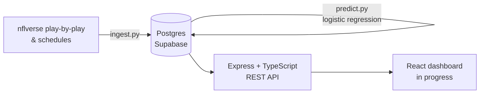

# NFL Team Efficiency Dashboard

A data pipeline, REST API, and win-probability model built on top of
[nflverse](https://github.com/nflverse/nflverse-data) play-by-play data —
surfacing team efficiency (EPA/play, success rate, points/drive) beyond raw
box scores, and predicting game outcomes from that efficiency data.

**Status:** data pipeline, API, and prediction model are live against a real
season of data. Frontend dashboard is in progress — see [Roadmap](#roadmap).

## Why EPA and success rate instead of raw yards/points

Raw yardage and point totals are noisy: a team can rack up yards against a
prevent defense in a blowout, or lose a close game on one fluky turnover.
**EPA (Expected Points Added)** measures how much a play actually moved a
team's expected scoring outcome given down, distance, and field position —
so a 4-yard gain on 3rd-and-3 (a successful, drive-extending play) scores
very differently than a 4-yard gain on 3rd-and-15. **Success rate** (percent
of plays with positive EPA) captures consistency independent of occasional
explosive plays. Together they're a much better proxy for "is this team
actually good on offense/defense" than yards or points alone — which is why
they're the foundation of every metric this project computes, rather than
just mirroring a standard box score.

## Architecture



- **Ingestion** (`ingest.py`): pulls a season's schedules, play-by-play, and
  player-week stats from nflverse, computes offense/defense/special-teams
  efficiency per team per week, and upserts everything into Postgres.
  Idempotent — safe to re-run every week as new games are played.
- **Prediction** (`predict.py`): builds each team's season-to-date efficiency
  "form" entering every game (falling back to the prior season's numbers for
  week 1), trains a logistic regression on home-vs-away efficiency
  differentials, and stores a win probability for every game that hasn't
  been played yet.
- **API** (`api/`): Express + TypeScript REST API serving teams, weekly
  trend data, head-to-head comparisons, and leaderboards.
- **Frontend**: React (Vite) dashboard — not yet built.

## Tech stack

| Layer | Choice |
|---|---|
| Data source | [nflverse-data](https://github.com/nflverse/nflverse-data) (play-by-play, schedules, player stats) |
| Ingestion / ML | Python, pandas, scikit-learn |
| Database | PostgreSQL (Supabase) |
| API | Node.js, Express, TypeScript |
| Frontend | React (Vite), Recharts *(planned)* |

## Reasoning for tech stack

**Data Source**: nflverse is a very detailed library of data, with new data coming in every week during the season. Nflverse provides more advanced metrics that can more accurately determine a team or a player's success.
**Ingestion / ML**: Python, pandas, scikit-learn are all very common for data ingestion and machine learning with thorough documentation.
**Database**: Familiar with PostgreSQL and Supabase was free.
**API**: I have 3 years of experience working with Node.js, Express, and TypeScript, so this felt the most comfortable for me.
**Frontend**: I have 3 years of experience working with React components, and around 1 year of experience with recharts.

## Project structure

```
nfl-metrics/
  schema.sql          # Postgres schema: teams, games, player_stats, team_week_stats, game_predictions
  ingest.py            # nflverse -> Postgres, run per season/week
  predict.py           # trains model, backtests, writes win probabilities
  requirements.txt
  api/
    src/
      index.ts          # Express app entrypoint
      db.ts              # Postgres connection pool
      routes/            # teams, compare, leaderboard
      lib/                # shared metric whitelist, query helpers
```

## Data model

- **teams** — the 32 NFL teams
- **games** — full season schedule, loaded up front (future games exist with
  `home_score`/`away_score` as `NULL` until played)
- **player_stats** — full weekly player box score + efficiency stats
  (passing/rushing/receiving, defense, kicking, punting, fantasy — mirrors
  nflverse's `stats_player_week` release column-for-column)
- **team_week_stats** — the core "advanced metrics" table: EPA/play, success
  rate, and points/drive, each split into offense, defense (`*_allowed`),
  and special teams (`st_*`)
- **game_predictions** — one row per game, refreshed each run for every game
  without a final score yet

## Running locally

**Prerequisites:** Python 3.11, Node 18+, a Postgres database (this project
uses Supabase's free tier).

```bash
# 1. Data pipeline (repo root)
python3.11 -m venv venv && source venv/bin/activate
pip install -r requirements.txt
cp .env.example .env   # fill in DATABASE_URL
python -c "conn=__import__('psycopg2').connect(__import__('os').environ['DATABASE_URL']); conn.cursor().execute(open('schema.sql').read()); conn.commit()"
python ingest.py --season 2025
python predict.py

# 2. API
cd api
npm install
cp .env.example .env   # fill in DATABASE_URL
npm run dev            # http://localhost:3000
```

### Weekly updates during the season

```bash
python ingest.py --season 2026   # pull whatever weeks have been played so far
python predict.py                 # retrain, refresh predictions for remaining games
```

Both scripts are idempotent (upsert-based) — safe to re-run as often as you
like.

## API

| Endpoint | Description |
|---|---|
| `GET /api/teams` | All 32 teams |
| `GET /api/teams/:abbreviation/stats?season=` | Weekly efficiency trend for one team (offense, defense, special teams) |
| `GET /api/compare?teamA=&teamB=&season=` | Side-by-side weekly series + season averages for two teams |
| `GET /api/leaderboard?metric=&order=&limit=` | Teams ranked by any of the 8 efficiency metrics |

`season` defaults to the most recent season with data, so these auto-advance
once 2026 games are loaded.

## Prediction model

A logistic regression trained on each team's season-to-date EPA/success
rate/points-per-drive form (offense, defense, and special teams — 8 features,
expressed as home-minus-away differentals) entering each game. Retrained
from scratch on every run using all games played so far. A rolling-origin
backtest (train on all strictly-earlier weeks, evaluate on the next) runs
each time to sanity-check accuracy before predictions are stored — currently
~60% accuracy on the 2025 season, which is meaningfully better than a coin
flip for a model using only pregame efficiency metrics (NFL outcomes are
inherently noisy).

## Roadmap

- React dashboard: team trend charts, head-to-head comparison view, leaderboard, upcoming-week predictions
- Deploy: frontend on Vercel, API on Railway, live demo link
- Weekly ingestion + prediction automated via a scheduled GitHub Action
- See open issues / commit history for in-progress work

## What I'd build next

Beyond the MVP, the natural next layer for a production version of this
app: caching for the leaderboard/comparison endpoints (they recompute
season averages on every request), an OpenAPI spec for the API, integration
tests around the ingestion upserts, and a richer model (recency-weighted
form, or opponent-adjusted efficiency) once more seasons of data are loaded.
